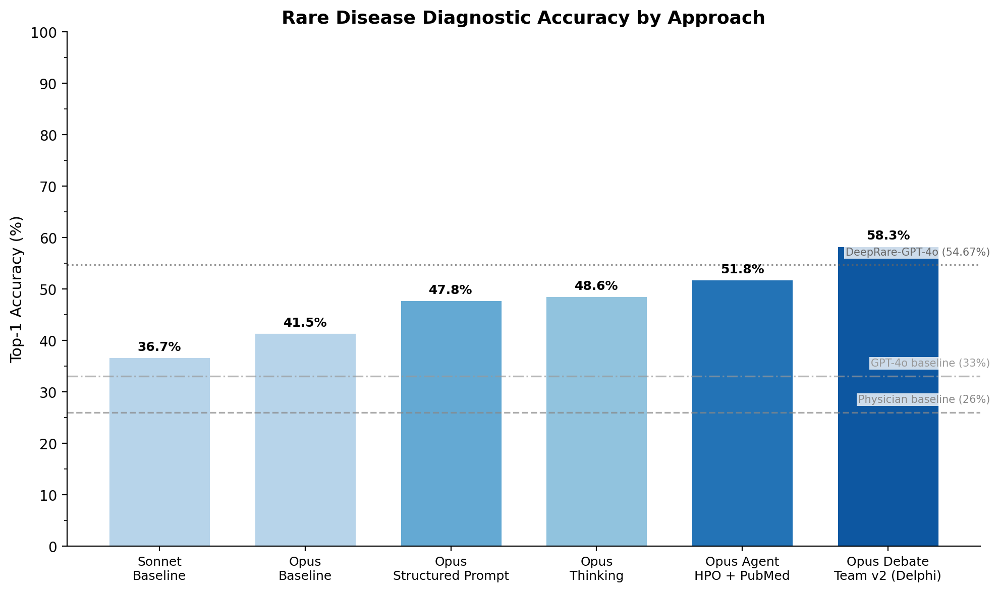
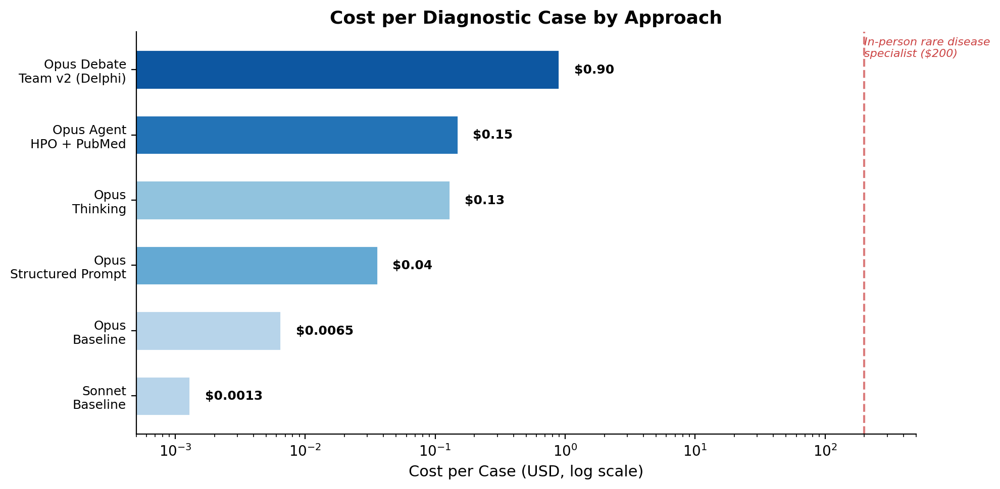

# RareArena Benchmark

*How much can Claude shorten the rare disease diagnostic odyssey — and what does a patient actually need to do to get the shortening?*

This repo benchmarks Claude on the [RareArena](https://github.com/zhao-zy15/RareArena) RDS dataset (8,562 case reports, *Lancet Digital Health* 2026) across a ladder of **consumer-accessible** capability tiers — from "just ask Claude" at one end, to a Delphi-style multi-agent architecture with HPO, PubMed, and WebSearch at the other. The goal is to map out what a patient (or their advocate) navigating a diagnostic odyssey can actually do today — using only publicly available tools — to compress a process that currently averages 4.7 years and starts with a 60% first-misdiagnosis rate.

---

## Headline results

On RareArena RDS (8,562 case reports, screening task — case text only, before tests):



| Tier | Condition | N | Top-1 | Top-5 | $/case |
|---|---|---|---|---|---|
| 1 | sonnet-baseline | 8,562 | 36.72% | 59.87% | $0.0013 |
| 1 | opus-baseline | 8,562 | 41.46% | 63.36% | $0.0065 |
| 4 | opus-hpo-injected | 500 | 42.00% | 59.40% | $0.009 |
| 2 | sonnet-thinking\* | 500 | 41.80% | 54.20% | $0.046 |
| 3 | opus-structured-prompt | 500 | 47.80% | 68.60% | $0.036 |
| 2 | opus-thinking | 500 | 48.60% | 68.80% | $0.13 |
| 6 | opus-debate-team (v1 naive) | 300 | 48.66% | 68.00% | $0.20 |
| 5 | opus-agent-hpo-pubmed | 500 | 51.80% | 71.80% | $0.15 |
| **6** | **opus-debate-team-v2 (Delphi)** | **300** | **58.34%** | **77.33%** | **$0.90** |

\* `sonnet-thinking` has a 27.6% parse-error rate from a harness bug that chokes on Sonnet's verbose thinking-mode output. Real numbers are higher than reported — don't cite as a clean comparison until the parser is hardened.

### Three reference points

- **Physician floor ~26% Top-1.** What most rare disease patients get at first contact (general physician, from the RareArena paper). Beating this is the threshold that matters most: it means an unassisted Claude is already more accurate than the patient's first doctor visit, before any tests.
- **GPT-4o (no tools) 33.05% Top-1.** The paper's frontier-LLM baseline on RDS. Claude Opus baseline (41.46%) clears this by ~8pp at the cheapest tier.
- **DeepRare 54.67% Top-1.** The institutional ceiling: a 6-agent custom system (SJTU, *Nature* 2026) with HPO+OMIM+Orphanet databases, 40 specialized tools, deployed at 600+ hospitals. Reported on the same RareArena RDS task for apples-to-apples comparison.

### The headline

**opus-debate-team-v2** — three reasoning-style specialists, full tool access (HPO + PubMed + WebSearch), Delphi-style two-round aggregation — hits **58.34% Top-1 / 77.33% Top-5** at N=300. That's **+16.88pp over opus-baseline** (p<0.0001) and **directionally matches DeepRare-GPT-4o's 54.67%** on the same benchmark.

The +3.67pp over DeepRare is **not statistically significant** (p≈0.10) — the right framing is "matches" or "in range", not "beats." The striking thing isn't that Claude edges a published institutional system — it's that a consumer-accessible setup (single Claude Code user with public MCP servers) can get there at all.

### Cost



Cost per case ranges over **three orders of magnitude**: from $0.0013 (unassisted Sonnet) to $0.90 (full Delphi debate team). For reference: an in-person rare disease specialist consultation runs ~$200. Even the peak-accuracy configuration is ~200× cheaper than that anchor, though of course it's not a substitute — the output is research assistance for a physician visit, not a diagnosis.

---

## What each tier represents

Every condition maps to a specific scenario a patient or their advocate could realistically set up, ordered from "available to anyone" to "requires real technical affordances":

### Tier 1 — "I asked Claude"
Just claude.ai or a basic API call. No tools, no thinking, one shot.

| Condition | N | What it represents |
|---|---|---|
| `sonnet-baseline` | 8,562 | Default claude.ai with Sonnet |
| `opus-baseline` | 8,562 | Claude.ai Pro with Opus |

**Finding:** Opus baseline (41.46%) already clears the physician floor (~26%) by 15pp and GPT-4o (33.05%) by 8pp. For free, no skill required.

### Tier 2 — "I asked Claude to think carefully"
Extended thinking mode on claude.ai Pro.

| Condition | N | What it represents |
|---|---|---|
| `opus-thinking` | 500 | Opus with adaptive extended thinking |
| `sonnet-thinking` | 500 | Sonnet version (cheaper, but parse-contaminated) |

**Finding:** +7pp over baseline on Top-1. Modest but real, at ~20× the cost per case.

### Tier 3 — "I gave Claude better instructions"
Same model, same lack of tools, just a structured clinical-reasoning prompt.

| Condition | N | What it represents |
|---|---|---|
| `opus-structured-prompt` | 500 | Problem representation → mechanism → differential → ranking |

**Finding:** +6pp over baseline. Matches `opus-thinking` for ~4× less cost. If you can only do one thing, a better prompt is the highest-leverage move.

### Tier 4 — "I ran code to look things up for Claude"
Technical tier. A Python pipeline extracts symptoms with Haiku, maps them to HPO/Orphanet candidates programmatically, and injects the candidates into the prompt.

| Condition | N | What it represents |
|---|---|---|
| `opus-hpo-injected` | 500 | Programmatic HPO lookup, candidates injected as context |

**Finding:** +0.5pp over baseline. The controlled injection test shows that static grounding alone doesn't help — the model needs to *decide* when and how to query the knowledge source for it to add value. This is the control that motivates Tier 5.

### Tier 5 — "I used Claude Code with medical MCPs"
Available today to anyone willing to install the CLI + two MCP servers.

| Condition | N | What it represents |
|---|---|---|
| `opus-agent-hpo-pubmed` | 500 | Claude Code + HPO MCP (pyhpo) + PubMed MCP (free), Opus chooses when to query |

**Finding:** +10pp over baseline on Top-1. Agentic tool use — where the model decides when to consult HPO vs. PubMed vs. its own knowledge — is where tool grounding starts materially working.

### Tier 6 — "Multiple Claude specialists consulted on my case"
Multi-agent. The lead agent spawns three specialist subagents; each reasons independently before synthesis.

| Condition | N | What it represents |
|---|---|---|
| `opus-debate-team` (v1) | 300 | Naive: lead gathers evidence once, 3 tool-less specialists reason from it |
| `opus-debate-team-v2` | 300 | **Delphi**: 3 reasoning-style specialists, each with full tools, two independent rounds with aggregated anonymized feedback |

**Finding:** v1 (48.66%) performs similarly to `opus-thinking` — a naive committee doesn't add value over one well-prompted agent. **v2 (58.34%)** is the architectural difference: split specialists by *reasoning style* (pattern matcher, mechanism reasoner, differential excluder), give each full tool access, run two rounds, preserve stood-firm dissent. +9.68pp over v1 (p=0.017) and +6.54pp over the best single-agent condition (p=0.07 — approaching significance).

---

## Statistical solidity of the key comparisons

At the final sample sizes:

| Comparison | Δ Top-1 | Statistical significance |
|---|---|---|
| v2 vs. opus-baseline | +16.88pp | Rock solid (z=5.8, p<0.0001) |
| v2 vs. debate-v1 | +9.68pp | Solid (z=2.38, p=0.017) |
| v2 vs. opus-thinking | +9.74pp | Solid (z=2.65, p=0.008) |
| v2 vs. agent-hpo-pubmed | +6.54pp | Approaching (z=1.81, p=0.07) |
| v2 vs. DeepRare-GPT-4o | +3.67pp | Not significant (p≈0.10) — "matches", not "beats" |

---

## What to read next

- **[METHODOLOGY.md](METHODOLOGY.md)** — experimental design: which cases, which N, why. The story arc behind the tier structure.
- **[AUDIT.md](AUDIT.md)** — honest self-audit against the "did Claude cheat by recognizing training data?" concern. Four tests: input isolation, case-text leakage, agent-output surface scan, date-gate memorization, tool-lift-by-year. Open caveats (poison test proposed but not run) are documented.
- **[plugin/rare-disease-consult/](plugin/rare-disease-consult/)** — a Claude Code plugin packaging the v2 architecture as an installable diagnostic consultation skill, with safety checks and dual-audience output.

---

## Setup

```bash
# Anthropic API key required
export ANTHROPIC_API_KEY=<your-key>

uv sync --extra all                    # everything (core + HPO + Agent SDK)
uv run python download_data.py         # pulls RareArena (~25MB) one-time
uv run python estimate_cost.py         # dry-run before spending
```

## Running a condition

```bash
# Smoke test first (5 cases, ~$0.05 for baseline)
uv run python run_condition.py --condition opus-baseline --task RDS --sample 5

# Full condition (resumable, safe to interrupt)
uv run python run_condition.py --condition opus-baseline --task RDS

# Score predictions against ground truth
uv run python eval_condition.py --condition opus-baseline --task RDS
uv run python metrics.py --condition opus-baseline --task RDS

# HPO-injection uses a different runner (three-phase Haiku→HPO→Opus pipeline)
uv run python run_injected.py --task RDS

# Agent/debate-team conditions need node in PATH for PubMed MCP
PATH="$HOME/.nvm/versions/node/v24.14.0/bin:$PATH" \
  uv run python run_condition.py --condition opus-debate-team-v2 --task RDS
```

See [METHODOLOGY.md](METHODOLOGY.md) for per-condition rationale on sample sizes.

## Benchmark campaign cost

Approximate Anthropic API spend to reproduce the results above:

| Condition | N | ~$ |
|---|---|---|
| sonnet-baseline | 8,562 | $11 |
| opus-baseline | 8,562 | $56 |
| opus-hpo-injected | 500 | $5 |
| sonnet-thinking | 500 | $23 |
| opus-structured-prompt | 500 | $18 |
| opus-thinking | 500 | $65 |
| opus-debate-team v1 | 300 | $60 |
| opus-agent-hpo-pubmed | 500 | $75 |
| opus-debate-team-v2 | 300 | $270 |
| Haiku evaluator | all | ~$15 |
| **Total** | | **~$600** |

Plus exploratory smoke tests and re-runs, the full campaign cost roughly **$700** of Anthropic API spend. Use `estimate_cost.py` before launching any condition.

## Attribution

Benchmark dataset: [RareArena](https://github.com/zhao-zy15/RareArena) (Zhao et al., *Lancet Digital Health* 2026). Licensed under [CC BY-NC-SA 4.0](https://creativecommons.org/licenses/by-nc-sa/4.0/), inherited here.

Comparison system: [DeepRare](https://www.nature.com/articles/s41586-025-10097-9) (Zhao et al., *Nature* 2026) — SJTU's 6-agent institutional rare-disease AI. Top-1 54.67% on RareArena RDS used as the apples-to-apples comparison.

HPO/Orphanet data: via [pyhpo](https://github.com/Centogene/pyhpo) (Centogene) and the [NLM Clinical Tables API](https://clinicaltables.nlm.nih.gov/). PubMed MCP: [@cyanheads/pubmed-mcp-server](https://github.com/cyanheads/pubmed-mcp-server).

## Related

- **[rare-disease-consult](plugin/rare-disease-consult/)** — the v2 architecture packaged as a Claude Code plugin, runnable on your own cases via an interactive diagnostic consultation workflow.
- **[health-coach](https://github.com/fryanpan/health-coach)** *(in progress)* — an open-source AI health coaching agent for navigating complex medical journeys. The `opus-debate-team-v2` architecture is slated for integration as a built-in capability.
